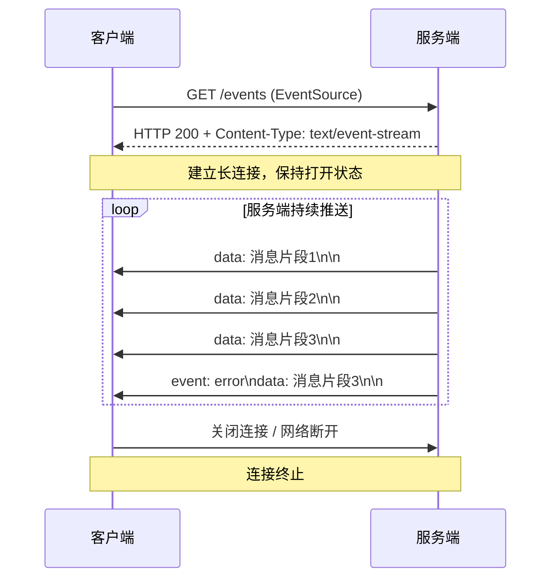
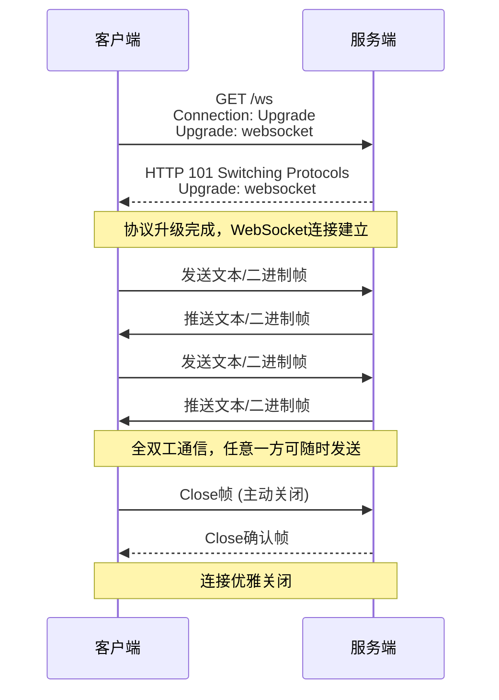

# 流式响应

源课程：[gitee.com/dev-edu/python-framework](https://gitee.com/dev-edu/python-framework)

## SSE模式

**关键特征**：
- 基于标准HTTP协议
- 单向通信：仅服务端→客户端推送
- 数据格式为`text/event-stream`，每条消息以双换行符(`\n\n`)结尾
- 适合新闻推送、股票行情、日志流等场景

Fast API 结合

| 项        | 信息                                                         |
| --------- | ------------------------------------------------------------ |
| 中间件    | 请求/响应会经过所有HTTP中间件 后续流式内容不经过中间件  |
| 异常处理  | 响应过程中的异常会经过异常处理函数 后续流式内容不经过异常处理函数 |
| 依赖注入  | 所有流式内容全部完成后才会迭代完成                           |
| token携带 | 原生`EventSource`只能将token放到query中 自定义或第三方库可以任意方式携带token |

## WebSocket模式

**关键特征**：
- 先通过HTTP握手，再升级为WebSocket独立协议（ws:// 或 wss://）
- 全双工通信：客户端和服务端均可主动发送消息
- 数据帧支持文本和二进制格式
- 适合在线聊天、多人协作、实时游戏等高频双向交互场景

Fast API 结合

| 项        | 信息                                         |
| --------- | -------------------------------------------- |
| 中间件    | 请求/响应都不会经过HTTP中间件                |
| 异常处理  | 不会经过异常处理函数                         |
| 依赖注入  | 连接断开后才会迭代结束                       |
| token携带 | 浏览器不支持自定义头，只能通过query携带token |

## SSE vs WebSocket 对比

| 特性 | SSE | WebSocket |
|------|-----|-----------|
| 通信方向 | 服务端→客户端（单向） | 全双工（双向） |
| 协议基础 | HTTP | 独立协议（基于HTTP握手） |
| 自动重连 | 原生支持 | 需手动实现 |
| 数据格式 | 文本（text/event-stream） | 文本或二进制 |
| 适用AI场景 | 简单的问答模式 | Agent 工作流 多人在线的AI协作 |

---

配套学习：

- <a href="/teach/lessons/fw-0020-流式响应.html">📖 互动教学课程（分级测验 + 面试实战）</a>
- <a href="/teach/reference/流式响应速查表.html">📋 流式响应速查表（可打印）</a>
