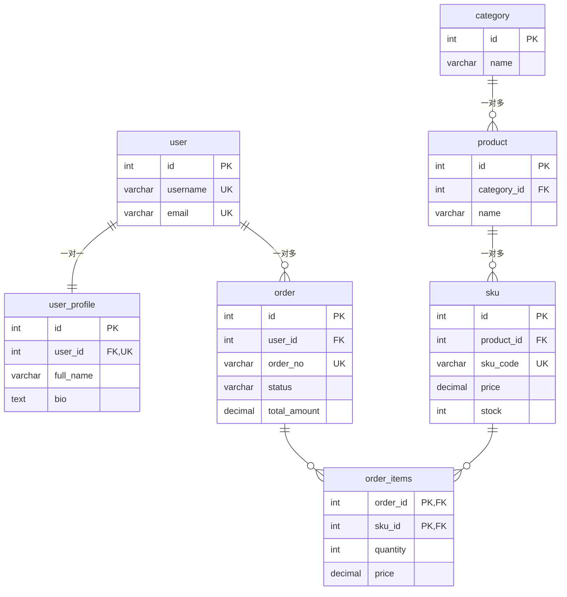

# 表间关系

## 为什么需要表间关系？

在关系型数据库中，为了**减少数据冗余**、**保证数据一致性**，我们会将数据拆分到多个表中。但拆开之后，如何把这些表重新关联起来？这就需要在表之间建立**关系**。

---

## 三种常见关系

### 一对一（1:1）

**定义**：A 和 B 可以描述为，一个 A 对应一个 B；一个 B 对应一个 A

常见的一对一关系：

- 用户和用户信息（详情）
- 员工和工位
- 订单与支付详情
- ...

> 数据库中，一对一关系理论上可以合并为一张表，只是为了性能考虑而拆分
>
> 哪些情况考虑拆分：
>
> - 访问频率差异明显
> - 单行数据量过大
> - 访问权限差异

**实现方式**：

- 在任意一表中添加**外键**指向另一表的主键
- 为这个外键加上 **UNIQUE** 约束，保证一对一

```sql
CREATE TABLE users (
    id SERIAL PRIMARY KEY,
    username VARCHAR(50) NOT NULL
);

CREATE TABLE user_profiles (
    id SERIAL PRIMARY KEY,
    user_id INTEGER UNIQUE NOT NULL,      -- UNIQUE 保证一对一
    bio TEXT,
    FOREIGN KEY (user_id) REFERENCES users(id)
);
```

---

### 一对多（1:N）⭐ 最常见

**定义**：一个 A 可以有多个 B；一个 B 只能对应一个 A

常见的一对多关系：

- 部门（departments）↔ 员工（employees）
- 分类（categories）↔ 商品（products）
- 用户（users）↔ 订单（orders）

**实现方式**：

- 在 **多** 的一方添加外键，指向 **一** 的一方的主键
- 外键不能加 UNIQUE

```sql
CREATE TABLE departments (
    id SERIAL PRIMARY KEY,
    name VARCHAR(50) NOT NULL
);

CREATE TABLE employees (
    id SERIAL PRIMARY KEY,
    name VARCHAR(50) NOT NULL,
    dept_id INTEGER NOT NULL,
    FOREIGN KEY (dept_id) REFERENCES departments(id)
    -- 多个员工可以属于同一个部门，所以 dept_id 不需要 UNIQUE
);
```

---

### 多对多（M:N）

**定义**：一个 A 对应多个 B；一个 B 对应多个 A

常见的多对多关系：

- 学生（students）↔ 课程（courses）
- 订单（orders）↔ 商品（products）
- 演员（actors）↔ 电影（movies）

**实现方式**：

- 多对多**不能直接实现**，必须引入一张**中间表（关联表）**
- 中间表包含两个外键，分别指向两张表的主键
- 这两个外键组成**联合主键**
- 中间表除了两个外键，还可以存放关系本身的附加属性（如 `enroll_date` 等）

```sql
CREATE TABLE students (
    id SERIAL PRIMARY KEY,
    name VARCHAR(50) NOT NULL
);

CREATE TABLE courses (
    id SERIAL PRIMARY KEY,
    title VARCHAR(100) NOT NULL
);

-- 中间表：记录学生和课程的选课关系
CREATE TABLE student_courses (
    student_id INTEGER NOT NULL,
    course_id  INTEGER NOT NULL,
    enroll_date DATE,
    PRIMARY KEY (student_id, course_id),          -- 联合主键
    FOREIGN KEY (student_id) REFERENCES students(id),
    FOREIGN KEY (course_id)  REFERENCES courses(id)
);
```

---

## 外键（Foreign Key）详解

### 什么是外键？

**外键（Foreign Key，简称 FK）** 是一个字段（或一组字段），它**指向另一张表的主键**，用来建立和加强两个表之间的连接。

| 术语 | 说明 |
|------|------|
| **主表（父表）** | 被引用的表 |
| **从表（子表）** | 包含外键的表 |

### 外键的约束行为

创建外键时可以指定当**父表数据被删除或更新**时，子表如何处理：

```sql
FOREIGN KEY (dept_id) REFERENCES departments(id)
    ON DELETE CASCADE    -- 级联删除：部门删除时，所属员工也删除
    ON UPDATE CASCADE;   -- 级联更新：部门id更新时，员工dept_id自动更新
```

| 选项 | 说明 |
|------|------|
| `NO ACTION`（PostgreSQL 默认） | 如果存在关联记录，禁止删除/更新父表，支持延迟检查（DEFERRABLE） |
| `RESTRICT` | 同 NO ACTION，但**不支持**延迟检查 |
| `CASCADE` | 级联操作：父表变更，子表自动跟随 |
| `SET NULL` | 父表删除/更新后，子表外键设为 NULL |

> 延迟检查和事务有关联，现在无法解释，你可以暂时认为`NO ACTION`和`RESTRICT`是等同的

### 外键的优缺点

| 优点 | 缺点 |
|------|------|
| 保证数据完整性，防止脏数据 | 降低写入性能（每次插入/更新需要检查） |
| 关系清晰，语义明确 | 在分库分表、分布式场景下难以使用 |
| 数据库层面自动约束 | 某些场景下级联操作难以追踪 |

> ⚠️ **实际开发中的权衡**：大型互联网项目中，有些团队会**放弃数据库外键**，在**应用层（代码中）保证数据完整性**，以获得更高性能。但在传统企业应用、ERP、财务系统中，外键仍是标准做法。

---

## ERD

**ERD（Entity-Relationship Diagram，实体关系图）** 是一种用于描述数据库中实体（表）及其之间关系的图形化工具。在 ERD 中，矩形代表实体（表），连线代表关系，并标注了关系的类型（1:1、1:N、M:N）。

下图是电商数据库的 ER 图，涵盖了三种表间关系：



---

## 🎓 互动教学课程

想检验自己是否真的掌握了表间关系？配套互动课程里有 4 个场景分析题和 1 道 ERD 找茬题，全部改编自本节练习题。

<a href="/teach/lessons/db-0003-表间关系.html"><strong>👉 点击进入《表间关系互动教学课程》</strong></a>

- ⏱️ 预计 15–20 分钟，9 道分级测验（初/中/高级各 3 道）+ 最终考核 + 面试实战
- 📋 配套<a href="/teach/reference/表间关系速查表.html">《表间关系速查表》</a>，术语与命令一页装下，可打印
- 💬 有不理解的地方，随时可以问你的 AI 老师
