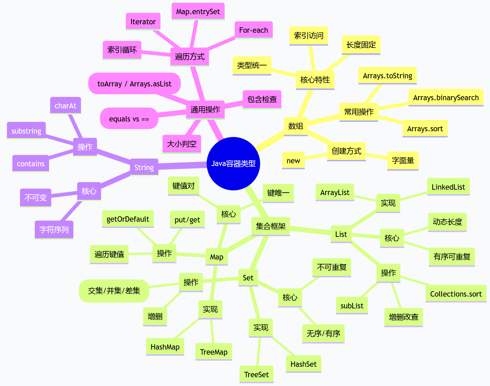

# 容器类型

## 课程目标

- 理解Java中的常用容器类型，能够基于需求选择合适的容器
- 掌握针对Java容器的通用操作
- 掌握特定容器的结构和使用方式

## 什么是容器类型？

容器类型用于**存储多个数据**。Java 中的容器主要分为**数组**和**集合框架（Collection Framework）** 两大类。集合框架提供了丰富的接口和实现类，常用的包括：

| 接口/类型 | 实现类                     | 是否可变         | 是否有序                                   | 元素是否可重复 | 示例             |
| --------- | -------------------------- | ---------------- | ------------------------------------------ | -------------- | ---------------- |
| `List`    | `ArrayList`, `LinkedList`  | 可变             | 有序（按插入顺序）                         | 可重复         | `[1, 2, 2, 3]`   |
| `Set`     | `HashSet`, `TreeSet`       | 可变             | `HashSet` 无序，`TreeSet` 有序（自然顺序） | 不可重复       | `{1, 2, 3}`      |
| `Map`     | `HashMap`, `TreeMap`       | 可变             | `HashMap` 无序，`TreeMap` 有序（按键排序） | 键不可重复     | `{"a":1, "b":2}` |
| `Queue`   | `ArrayDeque`, `LinkedList` | 可变             | 有序（FIFO 或优先级）                      | 可重复         | `[1, 2, 3]`      |
| 数组      | `int[]`, `String[]` 等     | 可变（长度固定） | 有序                                       | 可重复         | `{1, 2, 3}`      |
| `String`  | `String`（字符序列）       | 不可变           | 有序                                       | 可重复         | `"hello"`        |

> [!CAUTION]
>
> 数组长度固定，集合类长度动态可变。`String` 可以看作是不可变的字符序列，也支持索引、切片（通过 `substring`）等操作。

> [!CAUTION]
>
> 在Java中，容器往往与`泛型`一起使用，用于该容器中所保存的数据类型。关于泛型我们会在第6讲中具体展开，泛型的基础语法：`List<Integer> nums = new ArrayList<>()`

---

## List 接口（列表）

`List` 是**可变、有序**的集合，允许重复元素，通过索引访问。常用实现类：`ArrayList`（基于数组，随机访问快）和 `LinkedList`（基于链表，插入删除快）。

### 创建 List

```java
import java.util.ArrayList;
import java.util.LinkedList;
import java.util.List;
import java.util.Arrays;

// 使用 ArrayList
List<Integer> nums = new ArrayList<>();            // 空列表
List<String> fruits = new ArrayList<>(Arrays.asList("苹果", "香蕉", "橙子"));

// 使用 LinkedList
List<String> linked = new LinkedList<>();

// 通过 Arrays.asList 快速初始化
List<Integer> list = Arrays.asList(1, 2, 3, 4, 5); // 返回固定大小列表（不可增删，但可修改元素）
```

### 索引与切片（子列表）

```java
List<String> fruits = new ArrayList<>(Arrays.asList("苹果", "香蕉", "橙子", "葡萄", "西瓜"));

// 索引访问（从0开始）
System.out.println(fruits.get(0));   // 苹果
System.out.println(fruits.get(fruits.size() - 1)); // 西瓜

// 子列表（类似切片）[start, end) 不包括 end
List<String> sub = fruits.subList(1, 4); // [香蕉, 橙子, 葡萄]
System.out.println(sub);

// 注意：subList 是原列表的视图，修改会影响原列表
sub.set(0, "芒果");
System.out.println(fruits); // [苹果, 芒果, 橙子, 葡萄, 西瓜]
```

### List 操作

```java
List<Integer> nums = new ArrayList<>(Arrays.asList(1, 2, 3));

// 添加元素
nums.add(4);                 // [1, 2, 3, 4] 末尾添加
nums.add(0, 0);              // [0, 1, 2, 3, 4] 指定位置插入
nums.addAll(Arrays.asList(5, 6)); // [0,1,2,3,4,5,6] 批量添加

// 删除元素
nums.remove(Integer.valueOf(0)); // [1,2,3,4,5,6] 删除第一个匹配值（按对象）
nums.remove(0);                  // [2,3,4,5,6] 删除指定索引
Integer popped = nums.remove(nums.size() - 1); // 6, nums变为[2,3,4,5]
nums.clear();                    // [] 清空

// 查找与统计
nums = new ArrayList<>(Arrays.asList(1, 2, 3, 2, 4));
System.out.println(nums.indexOf(2));    // 1 第一个匹配的位置
System.out.println(nums.lastIndexOf(2));// 3 最后一个匹配的位置
System.out.println(Collections.frequency(nums, 2)); // 2 出现次数

// 排序与反转
Collections.sort(nums);                 // [1, 2, 2, 3, 4] 升序
Collections.sort(nums, Collections.reverseOrder()); // [4,3,2,2,1] 降序
Collections.reverse(nums);              // [1,2,2,3,4] 反转

// 修改元素
nums.set(0, 10); // [10, 2, 2, 3, 4]
```

---

## Set 接口（集合）

`Set` 是**无序（或有序）** 的集合，**不允许重复元素**。常用实现类：`HashSet`（哈希表，无序）、`TreeSet`（红黑树，按自然顺序或比较器排序）。

### 创建 Set

```java
import java.util.HashSet;
import java.util.TreeSet;
import java.util.Set;

// HashSet
Set<Integer> nums = new HashSet<>();
Set<String> chars = new HashSet<>(Arrays.asList("h", "e", "l", "l", "o")); // 自动去重

// TreeSet（有序）
Set<Integer> sorted = new TreeSet<>(Arrays.asList(3, 1, 4, 1, 5));
System.out.println(sorted); // [1, 3, 4, 5]（自动排序+去重）
```

### Set 操作

```java
Set<Integer> s = new HashSet<>(Arrays.asList(1, 2, 3));

// 添加/删除
s.add(4);          // {1,2,3,4}
s.remove(2);       // {1,3,4} 不存在则无效果
s.remove(10);      // 无效果，不报错
s.clear();         // {}

// 去重利器
List<Integer> list = Arrays.asList(1, 2, 2, 3, 3, 3);
Set<Integer> unique = new HashSet<>(list); // {1,2,3}（顺序不确定）
```

### 集合运算（交集、并集、差集）

```java
Set<Integer> s1 = new HashSet<>(Arrays.asList(1, 2, 3));
Set<Integer> s2 = new HashSet<>(Arrays.asList(2, 3, 4));

// 交集（保留 s1 中同时也存在于 s2 的元素）
Set<Integer> intersection = new HashSet<>(s1);
intersection.retainAll(s2); // {2, 3}

// 并集
Set<Integer> union = new HashSet<>(s1);
union.addAll(s2); // {1, 2, 3, 4}

// 差集（s1 - s2）
Set<Integer> diff = new HashSet<>(s1);
diff.removeAll(s2); // {1}
```

---

## Map 接口（字典，映射表，键值对）

`Map` 存储**键值对**，键不可重复，值可重复。常用实现类：`HashMap`（无序）、`TreeMap`（键有序）。

### 创建 Map

```java
import java.util.HashMap;
import java.util.TreeMap;
import java.util.Map;

// HashMap
Map<String, Integer> person = new HashMap<>();
person.put("age", 40); // 注意：Map 中键和值都是对象，这里用 String 和 Integer

// 也可以使用 Map.of 创建不可变Map（Java 9+）
Map<String, Integer> immutable = Map.of("age", 25, "score", 90);

// TreeMap（键有序）
Map<Integer, String> sortedMap = new TreeMap<>();
sortedMap.put(3, "three");
sortedMap.put(1, "one");
sortedMap.put(2, "two");
System.out.println(sortedMap); // {1=one, 2=two, 3=three}
```

### 访问与修改

```java
Map<String, Object> person = new HashMap<>();
person.put("name", "Alice");
person.put("age", 25);

// 访问
System.out.println(person.get("name")); // Alice
System.out.println(person.get("gender")); // null（不存在返回null）

// 安全访问（提供默认值）
String gender = (String) person.getOrDefault("gender", "未知");
System.out.println(gender); // 未知

// 添加/修改
person.put("gender", "女");    // 添加新键
person.put("age", 26);         // 修改已有键

// 批量更新
Map<String, Object> extra = new HashMap<>();
extra.put("phone", "123456");
extra.put("age", 27);
person.putAll(extra);

// 删除
person.remove("phone");        // 删除键值对
Object value = person.remove("age"); // 删除并返回值
person.clear();                // 清空
```

---

## 数组（Array）

数组是 Java 中最基础的容器，长度固定，元素类型统一，支持索引访问。

### 创建数组

```java
// 声明并初始化
int[] nums = {1, 2, 3, 4, 5};
String[] fruits = {"苹果", "香蕉", "橙子"};

// 使用 new 创建
int[] arr = new int[5];         // 默认元素为0
arr[0] = 10;

// 匿名数组
printArray(new int[]{1, 2, 3});
```

### 数组操作（借助 `Arrays` 工具类）

```java
import java.util.Arrays;

int[] nums = {3, 1, 4, 1, 5};

// 排序
Arrays.sort(nums);              // [1, 1, 3, 4, 5]

// 查找（必须先排序）
int index = Arrays.binarySearch(nums, 4); // 3

// 复制
int[] copy = Arrays.copyOf(nums, nums.length);

// 转字符串
System.out.println(Arrays.toString(nums)); // [1, 1, 3, 4, 5]

// 比较内容
int[] a = {1, 2, 3};
int[] b = {1, 2, 3};
System.out.println(Arrays.equals(a, b)); // true

// 填充
Arrays.fill(nums, 0);           // 全部置 0
```

> [!CAUTION]
>
> 数组长度固定，不能动态增减。如需动态容器，使用 `ArrayList` 等集合类。

---

## String 作为字符序列

`String` 是不可变的字符序列，可视为有序容器，支持索引、切片、遍历等操作。

### 创建与操作

```java
String s = "hello";

// 索引访问（字符）
System.out.println(s.charAt(0));   // h
System.out.println(s.charAt(s.length()-1)); // o

// 切片（子串）[start, end)
System.out.println(s.substring(1, 4)); // ell

// 包含判断
System.out.println(s.contains("el"));   // true
System.out.println(s.indexOf("x"));     // -1

// 连接与重复
String s2 = s.concat(" world"); // "hello world"
String s3 = s.repeat(2);        // "hellohello" (Java 11+)

// 遍历字符
for (char c : s.toCharArray()) {
    System.out.print(c + " ");  // h e l l o
}
```

---

## 通用操作

以下方法适用于所有集合类（`List`、`Set`、`Map` 等，数组使用 `Arrays` 工具类）。

### 集合通用方法

```java
List<Integer> list = Arrays.asList(1, 2, 3, 4);
Set<Integer> set = new HashSet<>(list);
Map<String, Integer> map = Map.of("a", 1, "b", 2);

// 大小
list.size();   // 4
set.size();    // 4
map.size();    // 2

// 是否为空
list.isEmpty(); // false

// 包含（Map 检查键，检查值用 containsValue）
list.contains(3);     // true
set.contains(3);      // true
map.containsKey("a"); // true
map.containsValue(2); // true

// 转数组
Integer[] arr = list.toArray(new Integer[0]);
```

### 连接与重复

Java 不支持 `+` 或 `*` 运算符直接操作集合，需使用方法：

```java
// 列表连接
List<Integer> list1 = new ArrayList<>(Arrays.asList(1, 2));
List<Integer> list2 = Arrays.asList(3, 4);
list1.addAll(list2); // [1, 2, 3, 4]

// 字符串重复（Java 11+）
String s = "ab".repeat(3); // "ababab"
```

### 相等比较：`equals` 和 `==`

- `==` 比较引用（是否同一对象）
- `equals` 比较内容

```java
List<Integer> a = new ArrayList<>(Arrays.asList(1, 2));
List<Integer> b = new ArrayList<>(Arrays.asList(1, 2));
System.out.println(a == b);      // false（不同对象）
System.out.println(a.equals(b)); // true（内容相同）

// 数组使用 Arrays.equals
int[] arr1 = {1, 2};
int[] arr2 = {1, 2};
System.out.println(arr1 == arr2);      // false
System.out.println(Arrays.equals(arr1, arr2)); // true
```

### 遍历容器

#### 索引遍历（List / 数组）

```java
// List 索引遍历
List<String> list = Arrays.asList("a", "b", "c");
for (int i = 0; i < list.size(); i++) {
    System.out.println(list.get(i));
}

// 数组索引遍历
int[] arr = {10, 20, 30};
for (int i = 0; i < arr.length; i++) {
    System.out.println(arr[i]);
}
```

#### 增强 for 循环（for-each）

适用于所有 `Iterable`（集合）和数组。

```java
// 遍历 List
for (String s : list) {
    System.out.println(s);
}

// 遍历 Set
for (int num : set) {
    System.out.println(num);
}

// 遍历数组
for (int val : arr) {
    System.out.println(val);
}

// 遍历 Map 的键值对
for (Map.Entry<String, Integer> entry : map.entrySet()) {
    System.out.println(entry.getKey() + "=" + entry.getValue());
}
```

#### 使用 Iterator（遍历过程中可删除元素）

```java
List<String> list = new ArrayList<>(Arrays.asList("a", "b", "c"));

Iterator<String> it = list.iterator();
while (it.hasNext()) {
    String item = it.next();
    if (item.equals("b")) {
        it.remove(); // 安全删除
    }
}
```

#### 遍历 Map 的三种方式

```java
Map<String, Integer> map = new HashMap<>();
map.put("a", 1);
map.put("b", 2);

// 1. 遍历键
for (String key : map.keySet()) {
    System.out.println(key);
}

// 2. 遍历值
for (Integer val : map.values()) {
    System.out.println(val);
}

// 3. 遍历键值对
for (Map.Entry<String, Integer> entry : map.entrySet()) {
    System.out.println(entry.getKey() + ": " + entry.getValue());
}
```

## 思维导图


